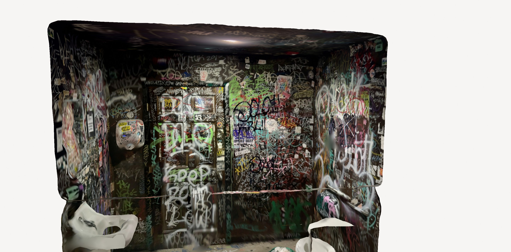

<!-- Heading -->
<h3 align="center">Hi there! I'm Henry Garant</h3>

Welcome to my GitHub profile! I'm a Full Stack Software Engineer [@Meta](https://www.linkedin.com/company/meta/)-[Reality Labs](https://www.meta.com/emerging-tech) passionate about crafting innovative, inspiring, and awesome products. I'm currently working on the [Horizon OS](https://www.meta.com/blog/meta-horizon-os-open-hardware-ecosystem-asus-republic-gamers-lenovo-xbox/?srsltid=AfmBOorj_btiAL2yc9HSycFlSRBkOQZyHqB6t7OehSi0CwsCSj8JfzY2) for the Meta Quest devices.

- 💬 Ask me about: Mixed/Augmented Reality, The Singularity, Horror Novels, Ice Hockey, Pottery, Hydroponics, etc.

- 🌱 Fun fact: I've made a [fully flourishing hydroponic garden](garden.jpg) growing in my downtown Philly apartment

## 🚀 Personal Projects // Fun Things

### Nullspace LLC | [Website](https://www.null-space.xyz/)
- Philadelphia-based software company that's trying many things until something gets strong product-market fit.
- [AR Model Hosting Service](https://www.null-space.xyz/models)

### Wine Party | [App](https://apps.apple.com/us/app/wine-party/id6744271442)
- An app for a social wine tasting experience.

### Capture The NFT | [Website](https://www.capturethenft.live) | [GitHub Repo](https://github.com/Henri93/Capture-The-NFT)
- Developed a Polygon Network web3 app for a virtual capture the flag game using NFTs.

### Bar Bathrooms | [Album](https://poly.cam/album/92C0269D-B961-4698-AC5A-763E7C581092)
- Documenting the amazing graffiti in bar bathrooms around the world.

## 📜 Patents

- [System and Methods for Controlling Intensity Level and Color of Lighting Devices According to a Show](https://patents.google.com/patent/CA3259236A1/en) — CA3259236A1, Lutron Technology Co LLC

## 📚 Reading

## 🎵 Music

## 🛠️ Tech Toolbox

- **Languages:**
<code></code>,
<code></code>,
<code></code>,
<code></code>,
<code></code>,
<code></code>,
<code></code>

- **Software:**
<code></code>,
<code></code>,
<code></code>,
<code></code>,
<code></code>,
ARKit, Pytorch, Jetpack Compose, Oculus VR

## 🎓 Education

**University of Pennsylvania | Computer Science, BSE**
*May 2020*
- [Mayor's Scholar of Philadelphia](https://srfs.upenn.edu/financial-aid/mayors-scholarship)

## 🌐 Let's Connect!

- [LinkedIn](https://www.linkedin.com/in/henry-garant/)
- Email: [henryRgarant@gmail.com](mailto:henryRgarant@gmail.com)
- Cell: (267)-670-0999
- [GitHub](https://github.com/Henri93)

Have a good day!

Thanks for dropping by! Feel free to connect for collaborations or just to chat about tech and innovation. 🚀

